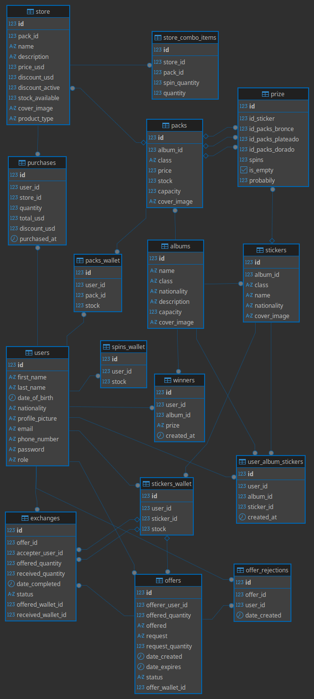

# FigusApp REST API

<p align="center">
  Backend para gestión de álbumes, compras, intercambios y autenticación JWT
</p>

<p align="center">
  
  
  
  
  
  
</p>

## 📋 Índice de contenidos

1. **[Tutorial pruebas locales](#tutorial-pruebas-locales)**
   - Configuración inicial del proyecto y base de datos
2. **[Documentación de endpoints](#documentación-de-endpoints)**
   - 2.1 [Users](#users-endpoints)
   - 2.2 [Purchases](#purchases-endpoints)
   - 2.3 [Offers](#offers-endpoints)
   - 2.4 [Wallet](#wallet-endpoints)
     - 2.4.1 [SpinsWallet](#spins-wallet-endpoints)
     - 2.4.2 [PacksWallet](#packs-wallet-endpoints)
     - 2.4.3 [StickersWallet](#stickers-wallet-endpoints)
   - 2.5 [Álbumes](#álbumes-endpoints-postman--jwt)
   - 2.6 [Packs](#packs-endpoints)
   - 2.7 [Stickers](#stickers-endpoints)
   - 2.8 [Prize](#prize-endpoints)
   - 2.9 [Store](#store-endpoints)
   - 2.10 [Contact](#contact-endpoints)
3. **[Pruebas unitarias con Jest](#3-pruebas-unitarias-con-jest)**
   - Ejecución de tests automáticos para validación del backend
4. **[Documentación adicional](#4-documentación-adicional)**
   - Recursos externos, diagramas, organización y repositorios del proyecto
5. **[Autores](#5-autores)**
   - Información de los desarrolladores del proyecto

## Tutorial pruebas locales

**Prerrequisitos:** Node.js 18+, PostgreSQL, Git

```bash
# 1. Clonar repositorio
git clone https://github.com/Manuirigoyen/figusApp-BackEnd.git
cd figusApp-BackEnd
npm install
# 2. Configurar variables de entorno
cp .env.example .env
# Editar .env con las credenciales de la base de datos
```

## Alternativa de Base de Datos Local

Para trabajar con una base de datos local en lugar de conectarse a Supabase, se puede utilizar el contenido de la carpeta ```src/migration```.

Dentro de este directorio se puede encontrar:
- Un archivo **SQL** listo para importar en el gestor de base de datos instalado.
- Un **Diagrama DER** con las relaciones de las tablas para entender mejor la estructura.

**Pasos para PostgreSQL local:**

1. Abrir un gestor de PostgreSQL como DBeaver y conectarse al servidor local.
2. Importar y ejecutar el archivo SQL provisto en la carpeta ```src/migration/```.
3. Actualizar tu archivo ```.env``` para que apunte al entorno local:
   - ```DB_USERNAME=tu_usuario```
   - ```DB_PASSWORD=tu_password```
   - ```DB_NAME=figusApp```
   - ```DB_HOST=localhost```
   - ```DB_PORT=5432```
---

## <a id="documentación-de-endpoints"></a>📚 Documentación de endpoints

---

## <a id="users-endpoints"></a>🧑 Users endpoints

### 🔓 Primero: obtener JWT token

**POST** `http://localhost:3000/api/v1/auth/login`

**Headers:** `Content-Type: application/json`

**Body (raw / JSON):**

```json
{
  "email": "lionel.messi@argentina.com",
  "password": "12345678",
  "captcha_token": "TOKEN_GENERADO_POR_TURNSTILE"
}
```

**Respuesta exitosa (200 OK):**

```json
{
  "access_token": "eyJhbGciOi..."
}
```

**Respuesta de error (401 Unauthorized):**

```json
{
    "statusCode": 401,
    "timestamp": "2026-05-11T23:35:11.657Z",
    "path": "/api/v1/auth/login",
    "method": "POST",
    "message": "Invalid credentials"
}
```

**Copiar `access_token` para todos los endpoints protegidos.**

---

### 🔓 Crear usuario (público)

**POST** `http://localhost:3000/api/v1/users`

**Headers:** `Content-Type: application/json`

**Body (raw / JSON):**

```json
{
  "first_name": "Lionel",
  "last_name": "Messi",
  "date_of_birth": "1987-06-24",
  "nationality": "AR",
  "email": "lionel.messi@argentina.com",
  "phone_number": "+54 11 5555-5555",
  "password": "12345678",
  "captcha_token": "TOKEN_GENERADO_POR_TURNSTILE"
}
```

---

### 🔒 GET protegidos (requieren JWT)

**Headers para todos:**

- Authorization: Bearer TU_ACCESS_TOKEN
- Content-Type: application/json

| Método | URL | Query/Params |
|--------|-----|--------------|
| GET | `/api/v1/users` | - |
| GET | `/api/v1/users/1` | - |
| GET | `/api/v1/users/email?email=lionel.messi@argentina.com` | `email` |
| GET | `/api/v1/users/search?search=Lionel` | `search` |
| GET | `/api/v1/users/nationality/AR/count` | `nationality` |
| GET | `/api/v1/users/1/purchases/count` | `id` |
| PUT | `/api/v1/users/1` | - |
| DELETE | `/api/v1/users/1` | - |

---

### 🔒 Actualizar usuario

**Method:** PUT  
**URL:** http://localhost:3000/api/v1/users/1  

**Headers:**  
Authorization: Bearer <JWT_TOKEN>  
Content-Type: application/json  

**Body (raw / JSON):**

```json
{
  "first_name": "Lionel Andrés",
  "nationality": "Argentina"
}
```

---

### 🔒 Eliminar usuario

**Method:** DELETE  
**URL:** http://localhost:3000/api/v1/users/1  

**Headers:**  
Authorization: Bearer <JWT_TOKEN>

---

## <a id="purchases-endpoints"></a>🧾 Purchases endpoints

| Método | Ruta | Acceso |
|--------|------|--------|
| GET | `/api/v1/purchases` | JWT |
| GET | `/api/v1/purchases/user/:userId` | JWT |
| GET | `/api/v1/purchases/store/:storeId` | JWT |
| GET | `/api/v1/purchases/user/:userId/count` | JWT |
| GET | `/api/v1/purchases/user/:userId/total` | JWT |
| GET | `/api/v1/purchases/date-range?start=YYYY-MM-DD&end=YYYY-MM-DD` | JWT |
| GET | `/api/v1/purchases/:id` | JWT |
| POST | `/api/v1/purchases` | Admin + JWT |
| PUT | `/api/v1/purchases/:id` | Admin + JWT |
| DELETE | `/api/v1/purchases/:id` | Admin + JWT |

---

### 🔒 Obtener todas las compras

**Method:** GET  
**URL:** http://localhost:3000/api/v1/purchases  

**Headers:**  
Authorization: Bearer <JWT_TOKEN>

---

### 🔒 Obtener compras por usuario

**Method:** GET  
**URL:** http://localhost:3000/api/v1/purchases/user/1  

**Headers:**  
Authorization: Bearer <JWT_TOKEN>

---

### 🔒 Obtener compras por tienda

**Method:** GET  
**URL:** http://localhost:3000/api/v1/purchases/store/1  

**Headers:**  
Authorization: Bearer <JWT_TOKEN>

---

### 🔒 Contar compras de usuario

**Method:** GET  
**URL:** http://localhost:3000/api/v1/purchases/user/1/count  

**Headers:**  
Authorization: Bearer <JWT_TOKEN>

---

### 🔒 Total gastado por usuario

**Method:** GET  
**URL:** http://localhost:3000/api/v1/purchases/user/1/total  

**Headers:**  
Authorization: Bearer <JWT_TOKEN>

---

### 🔒 Compras por rango de fechas

**Method:** GET  
**URL:** http://localhost:3000/api/v1/purchases/date-range?start=2024-01-01&end=2024-01-31  

**Headers:**  
Authorization: Bearer <JWT_TOKEN>

---

### 🔒 Obtener compra por ID

**Method:** GET  
**URL:** http://localhost:3000/api/v1/purchases/1  

**Headers:**  
Authorization: Bearer <JWT_TOKEN>

---

### 🔒 Crear compra (Admin + JWT)

**Method:** POST  
**URL:** http://localhost:3000/api/v1/purchases  

**Headers:**  
Authorization: Bearer <JWT_TOKEN>  
Content-Type: application/json  

**Body (raw / JSON):**

```json
{
  "user_id": 1,
  "store_id": 2,
  "total": 2500
}
```

---

### 🔒 Actualizar compra (Admin + JWT)

**Method:** PUT  
**URL:** http://localhost:3000/api/v1/purchases/1  

**Headers:**  
Authorization: Bearer <JWT_TOKEN>  
Content-Type: application/json  

**Body (raw / JSON):**

```json
{
  "total": 2700
}
```

---

### 🔒 Eliminar compra (Admin + JWT)

**Method:** DELETE  
**URL:** http://localhost:3000/api/v1/purchases/1  

**Headers:**  
Authorization: Bearer <JWT_TOKEN>

---

## <a id="offers-endpoints"></a>💬 Offers endpoints

| Método | Ruta | Acceso |
|--------|------|--------|
| GET | `/api/v1/offers` | JWT |
| GET | `/api/v1/offers/user/:userId` | JWT |
| GET | `/api/v1/offers/status/:status` | JWT |
| GET | `/api/v1/offers/user/:userId/active` | JWT |
| GET | `/api/v1/offers/active/count` | JWT |
| GET | `/api/v1/offers/expiring-soon` | JWT |
| GET | `/api/v1/offers/:id` | JWT |
| POST | `/api/v1/offers` | Admin + JWT |
| PUT | `/api/v1/offers/:id` | Admin + JWT |
| DELETE | `/api/v1/offers/:id` | Admin + JWT |

---

### 🔒 Obtener todas las ofertas

**Method:** GET  
**URL:** http://localhost:3000/api/v1/offers  

**Headers:**  
Authorization: Bearer <JWT_TOKEN>

---

### 🔒 Obtener ofertas por usuario

**Method:** GET  
**URL:** http://localhost:3000/api/v1/offers/user/1  

**Headers:**  
Authorization: Bearer <JWT_TOKEN>

---

### 🔒 Filtrar ofertas por estado

**Method:** GET  
**URL:** http://localhost:3000/api/v1/offers/status/pending  

**Headers:**  
Authorization: Bearer <JWT_TOKEN>

---

### 🔒 Verificar oferta activa por usuario

**Method:** GET  
**URL:** http://localhost:3000/api/v1/offers/user/1/active  

**Headers:**  
Authorization: Bearer <JWT_TOKEN>

---

### 🔒 Contar ofertas activas

**Method:** GET  
**URL:** http://localhost:3000/api/v1/offers/active/count  

**Headers:**  
Authorization: Bearer <JWT_TOKEN>

---

### 🔒 Listar ofertas próximas a expirar

**Method:** GET  
**URL:** http://localhost:3000/api/v1/offers/expiring-soon  

**Headers:**  
Authorization: Bearer <JWT_TOKEN>

---

### 🔒 Obtener oferta por ID

**Method:** GET  
**URL:** http://localhost:3000/api/v1/offers/1  

**Headers:**  
Authorization: Bearer <JWT_TOKEN>

---

### 🔒 Crear oferta (Admin + JWT)

**Method:** POST  
**URL:** http://localhost:3000/api/v1/offers  

**Headers:**  
Authorization: Bearer <JWT_TOKEN>  
Content-Type: application/json  

**Body (raw / JSON):**

```json
{
  "user_id": 1,
  "status": "pending",
  "amount": 1500,
  "expires_at": "2024-12-31T23:59:59Z"
}
```

---

### 🔒 Actualizar oferta (Admin + JWT)

**Method:** PUT  
**URL:** http://localhost:3000/api/v1/offers/1  

**Headers:**  
Authorization: Bearer <JWT_TOKEN>  
Content-Type: application/json  

**Body (raw / JSON):**

```json
{
  "status": "accepted"
}
```

---

### 🔒 Eliminar oferta (Admin + JWT)

**Method:** DELETE  
**URL:** http://localhost:3000/api/v1/offers/1  

**Headers:**  
Authorization: Bearer <JWT_TOKEN>

---

## <a id="wallet-endpoints"></a>💰 Wallet endpoints

### <a id="spins-wallet-endpoints"></a>🎰 SpinsWallet endpoints

| Método | Ruta | Acceso |
|--------|------|--------|
| GET | `/api/v1/spins-wallet` | JWT |
| GET | `/api/v1/spins-wallet/:id` | JWT |
| POST | `/api/v1/spins-wallet` | Admin + JWT |
| PUT | `/api/v1/spins-wallet/:id` | Admin + JWT |
| DELETE | `/api/v1/spins-wallet/:id` | Admin + JWT |

---

### 🔒 Obtener todas las wallets de spins

**Method:** GET  
**URL:** http://localhost:3000/api/v1/spins-wallet  

**Headers:**  
Authorization: Bearer <JWT_TOKEN>

---

### 🔒 Obtener wallet de spins por ID

**Method:** GET  
**URL:** http://localhost:3000/api/v1/spins-wallet/1  

**Headers:**  
Authorization: Bearer <JWT_TOKEN>

---

### 🔒 Crear wallet de spins (Admin + JWT)

**Method:** POST  
**URL:** http://localhost:3000/api/v1/spins-wallet  

**Headers:**  
Authorization: Bearer <JWT_TOKEN>  
Content-Type: application/json  

**Body (raw / JSON):**

```json
{
  "user_id": 1,
  "spins": 10,
  "last_spin": "2023-12-01T00:00:00Z"
}
```

---

### 🔒 Actualizar wallet de spins (Admin + JWT)

**Method:** PUT  
**URL:** http://localhost:3000/api/v1/spins-wallet/1  

**Headers:**  
Authorization: Bearer <JWT_TOKEN>  
Content-Type: application/json  

**Body (raw / JSON):**

```json
{
  "spins": 15,
  "last_spin": "2023-12-02T00:00:00Z"
}
```

---

### 🔒 Eliminar wallet de spins (Admin + JWT)

**Method:** DELETE  
**URL:** http://localhost:3000/api/v1/spins-wallet/1  

**Headers:**  
Authorization: Bearer <JWT_TOKEN>

---

### <a id="packs-wallet-endpoints"></a>📦 PacksWallet endpoints

| Método | Ruta | Acceso |
|--------|------|--------|
| GET | `/api/v1/packs-wallet` | JWT |
| GET | `/api/v1/packs-wallet/:id` | JWT |
| POST | `/api/v1/packs-wallet` | Admin + JWT |
| PUT | `/api/v1/packs-wallet/:id` | Admin + JWT |
| DELETE | `/api/v1/packs-wallet/:id` | Admin + JWT |

---

### 🔒 Obtener todas las wallets de packs

**Method:** GET  
**URL:** http://localhost:3000/api/v1/packs-wallet  

**Headers:**  
Authorization: Bearer <JWT_TOKEN>

---

### 🔒 Obtener wallet de packs por ID

**Method:** GET  
**URL:** http://localhost:3000/api/v1/packs-wallet/1  

**Headers:**  
Authorization: Bearer <JWT_TOKEN>

---

### 🔒 Crear wallet de packs (Admin + JWT)

**Method:** POST  
**URL:** http://localhost:3000/api/v1/packs-wallet  

**Headers:**  
Authorization: Bearer <JWT_TOKEN>  
Content-Type: application/json  

**Body (raw / JSON):**

```json
{
  "user_id": 1,
  "pack_id": 2,
  "quantity": 5
}
```

---

### 🔒 Actualizar wallet de packs (Admin + JWT)

**Method:** PUT  
**URL:** http://localhost:3000/api/v1/packs-wallet/1  

**Headers:**  
Authorization: Bearer <JWT_TOKEN>  
Content-Type: application/json  

**Body (raw / JSON):**

```json
{
  "quantity": 10
}
```

---

### 🔒 Eliminar wallet de packs (Admin + JWT)

**Method:** DELETE  
**URL:** http://localhost:3000/api/v1/packs-wallet/1  

**Headers:**  
Authorization: Bearer <JWT_TOKEN>

---

### <a id="stickers-wallet-endpoints"></a>🧷 StickersWallet endpoints

| Método | Ruta | Acceso |
|--------|------|--------|
| GET | `/api/v1/stickers-wallet` | JWT |
| GET | `/api/v1/stickers-wallet/:id` | JWT |
| POST | `/api/v1/stickers-wallet` | Admin + JWT |
| PUT | `/api/v1/stickers-wallet/:id` | Admin + JWT |
| DELETE | `/api/v1/stickers-wallet/:id` | Admin + JWT |

---

### 🔒 Obtener todas las wallets de stickers

**Method:** GET  
**URL:** http://localhost:3000/api/v1/stickers-wallet  

**Headers:**  
Authorization: Bearer <JWT_TOKEN>

---

### 🔒 Obtener wallet de stickers por ID

**Method:** GET  
**URL:** http://localhost:3000/api/v1/stickers-wallet/1  

**Headers:**  
Authorization: Bearer <JWT_TOKEN>

---

### 🔒 Crear wallet de stickers (Admin + JWT)

**Method:** POST  
**URL:** http://localhost:3000/api/v1/stickers-wallet  

**Headers:**  
Authorization: Bearer <JWT_TOKEN>  
Content-Type: application/json  

**Body (raw / JSON):**

```json
{
  "user_id": 1,
  "sticker_id": 3,
  "quantity": 2
}
```

---

### 🔒 Actualizar wallet de stickers (Admin + JWT)

**Method:** PUT  
**URL:** http://localhost:3000/api/v1/stickers-wallet/1  

**Headers:**  
Authorization: Bearer <JWT_TOKEN>  
Content-Type: application/json  

**Body (raw / JSON):**

```json
{
  "quantity": 5
}
```

---

### 🔒 Eliminar wallet de stickers (Admin + JWT)

**Method:** DELETE  
**URL:** http://localhost:3000/api/v1/stickers-wallet/1  

**Headers:**  
Authorization: Bearer <JWT_TOKEN>

---

## <a id="álbumes-endpoints-postman--jwt"></a>📚 Endpoints álbumes

| Método | Ruta | Acceso |
|--------|------|--------|
| GET | `/api/v1/albums` | Público |
| GET | `/api/v1/albums/:id` | Público |
| POST | `/api/v1/albums` | Admin + JWT |
| PUT | `/api/v1/albums/:id` | Admin + JWT |
| DELETE | `/api/v1/albums/:id` | Admin + JWT |

---

### 🔓 Obtener todos los álbumes

**Method:** GET  
**URL:** http://localhost:3000/api/v1/albums  

**Headers:**  
Ninguno (ruta pública)

---

### 🔓 Obtener álbum por ID

**Method:** GET  
**URL:** http://localhost:3000/api/v1/albums/1  

**Headers:**  
Ninguno (ruta pública)

---

### 🔒 Crear álbum (Admin + JWT)

**Method:** POST  
**URL:** http://localhost:3000/api/v1/albums  

**Headers:**  
Authorization: Bearer <JWT_TOKEN>  
Content-Type: application/json  

**Body (raw / JSON):**

```json
{
  "name": "Qatar 2022",
  "class": "Premium",
  "nationality": "Argentina",
  "description": "Álbum oficial de la Copa Mundial FIFA Qatar 2022",
  "capacity": 11,
}
```

---

### 🔒 Actualizar álbum

**Method:** PUT  
**URL:** http://localhost:3000/api/v1/albums/1  

**Headers:**  
Authorization: Bearer <JWT_TOKEN>  
Content-Type: application/json  

**Body (raw / JSON):**

```json
{
  "name": "Qatar 2022 - Edición Campeones",
  "class": "Premium",
  "nationality": "Argentina",
  "description": "Edición especial campeones del mundo",
  "capacity": 12,
}
```

---

### 🔒 Eliminar álbum

**Method:** DELETE  
**URL:** http://localhost:3000/api/v1/albums/1  

**Headers:**  
Authorization: Bearer <JWT_TOKEN>

---

## <a id="packs-endpoints"></a>📦 Endpoints packs

| Método | Ruta | Acceso |
|--------|------|--------|
| GET | `/api/v1/packs` | Público |
| GET | `/api/v1/packs/:id` | Público |
| POST | `/api/v1/packs` | Admin + JWT |
| PUT | `/api/v1/packs/:id` | Admin + JWT |
| DELETE | `/api/v1/packs/:id` | Admin + JWT |

---

### 📦 Obtener todos los packs

**Method:** GET  
**URL:** http://localhost:3000/api/v1/packs  

**Headers:**  
Ninguno (ruta pública)

---

### 📦 Obtener pack por ID

**Method:** GET  
**URL:** http://localhost:3000/api/v1/packs/1  

**Headers:**  
Ninguno (ruta pública)

---

### 📦 Crear pack (Admin + JWT)

**Method:** POST  
**URL:** http://localhost:3000/api/v1/packs  

**Headers:**  
Authorization: Bearer <JWT_TOKEN>  
Content-Type: application/json  

**Body (raw / JSON):**

```json
{
  "album_id": 1,
  "class": "Especial",
  "price": 2500,
  "stock": 100,
  "capacity": 5
}
```

---

### 📦 Actualizar pack (Admin + JWT)

**Method:** PATCH  
**URL:** http://localhost:3000/api/v1/packs/1  

**Headers:**  
Authorization: Bearer <JWT_TOKEN>  
Content-Type: application/json  

**Body (raw / JSON):**

```json
{
  "class": "Legendario",
  "price": 3000,
  "stock": 80,
  "capacity": 6
}
```

---

### 📦 Eliminar pack (Admin + JWT)

**Method:** DELETE  
**URL:** http://localhost:3000/api/v1/packs/1  

**Headers:**  
Authorization: Bearer <JWT_TOKEN>

---

## <a id="stickers-endpoints"></a>🧷 Endpoints stickers

| Método | Ruta | Acceso |
|--------|------|--------|
| GET | `/api/v1/stickers` | Público |
| GET | `/api/v1/stickers/:id` | Público |
| POST | `/api/v1/stickers` | Admin + JWT |
| PUT | `/api/v1/stickers/:id` | Admin + JWT |
| DELETE | `/api/v1/stickers/:id` | Admin + JWT |

---

### Obtener todos los stickers

**Method:** GET  
**URL:** http://localhost:3000/api/v1/stickers  

**Headers:**  
Ninguno (ruta pública)

---

### Obtener sticker por ID

**Method:** GET  
**URL:** http://localhost:3000/api/v1/stickers/1  

**Headers:**  
Ninguno (ruta pública)

---

### Crear sticker (Admin + JWT)

**Method:** POST  
**URL:** http://localhost:3000/api/v1/stickers  

**Headers:**  
Authorization: Bearer <JWT_TOKEN>  
Content-Type: application/json  

**Body (raw / JSON):**

```json
{
  "pack_id": 2,
  "class": "Legendaria",
  "name": "Lionel Messi",
  "nationality": "Argentina",
}
```

---

### Actualizar sticker (Admin + JWT)

**Method:** PUT  
**URL:** http://localhost:3000/api/v1/stickers/1  

**Headers:**  
Authorization: Bearer <JWT_TOKEN>  
Content-Type: application/json  

**Body (raw / JSON):**

```json
{
  "pack_id": 2,
  "class": "Especial",
  "name": "Lionel Messi Campeón",
  "nationality": "Argentina",
}
```

---

### Eliminar sticker (Admin + JWT)

**Method:** DELETE  
**URL:** http://localhost:3000/api/v1/stickers/1  

**Headers:**  
Authorization: Bearer <JWT_TOKEN>  
Content-Type: application/json

---

## <a id="prize-endpoints"></a>🏆 Endpoints Prize

| Método | Ruta | Acceso |
|--------|------|--------|
| GET | `/api/v1/prizes` | Público |
| GET | `/api/v1/prizes/probability` | Público |
| GET | `/api/v1/prizes/available/count` | Público |
| GET | `/api/v1/prizes/random` | Público |
| GET | `/api/v1/prizes/:id` | Público |
| POST | `/api/v1/prizes` | Admin + JWT |
| PUT | `/api/v1/prizes/:id/empty` | Admin + JWT |
| DELETE | `/api/v1/prizes/:id` | Admin + JWT |

---

### 🔓 Obtener todos los premios

**Method:** GET  
**URL:** http://localhost:3000/api/v1/prizes  

**Headers:**  
Ninguno (ruta pública)

---

### 🔓 Obtener premios por probabilidad

**Method:** GET  
**URL:** http://localhost:3000/api/v1/prizes/probability  

**Headers:**  
Ninguno (ruta pública)

---

### 🔓 Contar premios disponibles

**Method:** GET  
**URL:** http://localhost:3000/api/v1/prizes/available/count  

**Headers:**  
Ninguno (ruta pública)

---

### 🔓 Obtener premio aleatorio

**Method:** GET  
**URL:** http://localhost:3000/api/v1/prizes/random  

**Headers:**  
Ninguno (ruta pública)

---

### 🔓 Obtener premio por ID

**Method:** GET  
**URL:** http://localhost:3000/api/v1/prizes/1  

**Headers:**  
Ninguno (ruta pública)

---

### 🔒 Crear premio (Admin + JWT)

**Method:** POST  
**URL:** http://localhost:3000/api/v1/prizes  

**Headers:**  
Authorization: Bearer <JWT_TOKEN>  
Content-Type: application/json  

**Body (raw / JSON):**

```json
{
  "name": "Premio Dorado",
  "description": "Sticker especial edición limitada",
  "probability": 0.05,
  "stock": 10,
  "value": 500
}
```

---

### 🔒 Marcar premio como vacío (Admin + JWT)

**Method:** PUT  
**URL:** http://localhost:3000/api/v1/prizes/1/empty  

**Headers:**  
Authorization: Bearer <JWT_TOKEN>  
Content-Type: application/json

---

### 🔒 Eliminar premio (Admin + JWT)

**Method:** DELETE  
**URL:** http://localhost:3000/api/v1/prizes/1  

**Headers:**  
Authorization: Bearer <JWT_TOKEN>  
Content-Type: application/json

---

## <a id="store-endpoints"></a>🛒 Store endpoints

| Método | Ruta | Acceso |
|--------|------|--------|
| GET | `/api/v1/stores` | Público |
| GET | `/api/v1/stores/type/:productType` | Público |
| GET | `/api/v1/stores/discount` | Público |
| GET | `/api/v1/stores/type/:productType/count` | Público |
| GET | `/api/v1/stores/type/:productType/cheapest` | Público |
| GET | `/api/v1/stores/price-range?minPrice=X&maxPrice=Y` | Público |
| GET | `/api/v1/stores/:id` | Público |
| POST | `/api/v1/stores` | Admin + JWT |
| PUT | `/api/v1/stores/:id` | Admin + JWT |
| DELETE | `/api/v1/stores/:id` | Admin + JWT |

---

### 🔓 Obtener todos los productos

**Method:** GET  
**URL:** http://localhost:3000/api/v1/stores  

**Headers:**  
Ninguno (ruta pública)

---

### 🔓 Obtener productos por tipo

**Method:** GET  
**URL:** http://localhost:3000/api/v1/stores/type/album  

**Headers:**  
Ninguno (ruta pública)

---

### 🔓 Obtener productos con descuento

**Method:** GET  
**URL:** http://localhost:3000/api/v1/stores/discount  

**Headers:**  
Ninguno (ruta pública)

---

### 🔓 Contar productos por tipo

**Method:** GET  
**URL:** http://localhost:3000/api/v1/stores/type/album/count  

**Headers:**  
Ninguno (ruta pública)

---

### 🔓 Obtener producto más barato por tipo

**Method:** GET  
**URL:** http://localhost:3000/api/v1/stores/type/album/cheapest  

**Headers:**  
Ninguno (ruta pública)

---

### 🔓 Obtener productos por rango de precio

**Method:** GET  
**URL:** http://localhost:3000/api/v1/stores/price-range?minPrice=100&maxPrice=500  

**Headers:**  
Ninguno (ruta pública)

---

### 🔓 Obtener producto por ID

**Method:** GET  
**URL:** http://localhost:3000/api/v1/stores/1  

**Headers:**  
Ninguno (ruta pública)

---

### 🔒 Crear producto (Admin + JWT)

**Method:** POST  
**URL:** http://localhost:3000/api/v1/stores  

**Headers:**  
Authorization: Bearer <JWT_TOKEN>  
Content-Type: application/json  

**Body (raw / JSON):**

```json
{
  "name": "Pack Especial Qatar",
  "description": "Pack con stickers especiales",
  "price": 2500,
  "product_type": "pack",
  "product_id": 1,
  "discount_percentage": 10
}
```

---

### 🔒 Actualizar producto (Admin + JWT)

**Method:** PUT  
**URL:** http://localhost:3000/api/v1/stores/1  

**Headers:**  
Authorization: Bearer <JWT_TOKEN>  
Content-Type: application/json  

**Body (raw / JSON):**

```json
{
  "price": 2200,
  "discount_percentage": 15
}
```

---

### 🔒 Eliminar producto (Admin + JWT)

**Method:** DELETE  
**URL:** http://localhost:3000/api/v1/stores/1  

**Headers:**  
Authorization: Bearer <JWT_TOKEN>  
Content-Type: application/json

---

## <a id="contact-endpoints"></a>📧 Contact endpoints

### Descripción

El endpoint `POST /contact` permite recibir consultas enviadas por los usuarios.

Actualmente este módulo funciona como un prototipo de validación y simulación de recepción de consultas.

| Método | Ruta | Acceso |
|--------|------|--------|
| POST | `/api/v1/contact` | Público |

---

### 🔓 Enviar consulta de contacto

**Method:** POST  
**URL:** http://localhost:3000/api/v1/contact  

**Headers:**  
Content-Type: application/json

**Body (raw / JSON):**

```json
{
  "contact_reason": "soporte",
  "contact_email": "usuario@email.com",
  "contact_message": "Necesito ayuda con mi cuenta.",
  "captcha_token": "TOKEN_GENERADO_POR_TURNSTILE"
}
```

**Respuesta exitosa (200 OK):**

```json
{
  "message": "Consulta enviada correctamente."
}
```

---

# 3. Pruebas unitarias con Jest

El proyecto utiliza Jest para realizar pruebas unitarias automáticas sobre los servicios y funcionalidades críticas del backend.

## Iniciar el backend

```bash
npm run start:dev
```

## Ejecutar pruebas unitarias

```bash
npm run test
```

---

# <a id="4-documentación-adicional"></a>
## Organización del proyecto

- Trello:
https://trello.com/invite/b/68e82fd95700727537053f02/ATTI91bc86a24cda0e3ef2926bc869545b2d167103A4/figurapp

- Canva:
https://canva.link/7nz9bd1u8p3vo09

---

## Diseño de base de datos

- Diagrama DER:


---

## Documentación técnica

- Documentación SRS y diagramas:
https://drive.google.com/drive/folders/1SR6jY9gl2wYNKjZ0bYFenQG6hRN2-CCe?usp=drive_link 

---

## Repositorios

- Frontend:
https://github.com/Manuirigoyen/figusApp-FrontEnd.git

---

## 5. Autores

Proyecto desarrollado por Martín Lorenzi y Manuel Irigoyen.

---

### Martín Lorenzi


📧 **Contacto:** [alorenzi@alumnos.exa.unicen.edu.ar](mailto:alorenzi@alumnos.exa.unicen.edu.ar)

---

### Manuel Irigoyen


📧 **Contacto:** [manuirigoyen@hotmail.com](mailto:manuirigoyen@hotmail.com)

---
